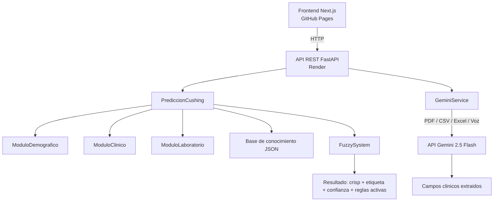

# C.O.C.O. — Motor de Inferencia Difusa para la Prediccion del Sindrome de Cushing Canino

Trabajo de Fin de Grado de Ingenieria Informatica — Universidad de Granada  
Autor: Manuel Martinez Cobos

---

## Descripcion general

C.O.C.O. es un sistema de apoyo a la decision clinica veterinaria basado en logica difusa. Su objetivo es estimar el nivel de riesgo o sospecha de Sindrome de Cushing en perros a partir de variables demograficas, signos clinicos y resultados de laboratorio.

El sistema no emite diagnosticos: produce una estimacion de riesgo continua en el intervalo [0, 1] junto con una etiqueta linguistica y metricas de confianza internas del motor. La interpretacion final corresponde siempre al veterinario responsable.

El proyecto se divide en dos componentes principales:

- **Backend**: motor de inferencia difusa (Mamdani), base de conocimiento en JSON, API REST y servicio de extraccion de datos mediante IA generativa.
- **Frontend**: interfaz web de analisis y visualizacion de resultados.

---

## Indice

1. [Arquitectura del sistema](#1-arquitectura-del-sistema)
2. [Estructura del repositorio](#2-estructura-del-repositorio)
3. [Puesta en marcha](#3-puesta-en-marcha)
4. [API REST](#4-api-rest)
5. [Motor de inferencia difusa](#5-motor-de-inferencia-difusa)
6. [Base de conocimiento JSON](#6-base-de-conocimiento-json)
7. [Integracion con Gemini](#7-integracion-con-gemini)
8. [Frontend](#8-frontend)
9. [Tests](#9-tests)
10. [Integracion continua y despliegue](#10-integracion-continua-y-despliegue)
11. [Documentacion tecnica](#11-documentacion-tecnica)
12. [Como extender el sistema](#12-como-extender-el-sistema)
13. [Notas operativas](#13-notas-operativas)
14. [Referencias internas](#14-referencias-internas)

---

## 1) Arquitectura del sistema



### Capas principales

1. **Frontend (Next.js)**: interfaz web que permite al usuario introducir los datos del paciente manualmente, cargar un documento clinico o dictar los datos por voz. Muestra el resultado de la inferencia con visualizaciones.

2. **API REST (FastAPI)**: expone los endpoints de prediccion y de extraccion de datos. Actua como intermediario entre el frontend y el motor difuso o el servicio de Gemini.

3. **Modulos de entrada**: encapsulan los datos del paciente por dominio (`ModuloDemografico`, `ModuloClinico`, `ModuloLaboratorio`). Son clases simples con getters y setters.

4. **Fachada de prediccion (`PrediccionCushing`)**: carga la base de conocimiento desde JSON, construye variables y reglas difusas, mapea los modulos al diccionario de entradas del motor y ejecuta la inferencia.

5. **Motor difuso (`logicaDifusa/FuzzySystem`)**: implementa el ciclo Mamdani completo: evaluacion de reglas (AND/OR con peso), agregacion (MAX), implicacion (MIN/recorte) y defuzzificacion por centroide. Calcula ademas las metricas de fuerza, consenso y confianza.

6. **Base de conocimiento JSON**: define variables, universos, funciones de pertenencia y reglas en archivos JSON independientes del codigo. Permite modificar la logica clinica sin alterar la implementacion del motor.

7. **Servicio de extraccion con IA (`GeminiService`)**: procesa documentos clinicos (PDF, CSV, Excel) o transcripciones de voz dictadas por el veterinario mediante la API de Gemini 2.5 Flash y devuelve los campos del formulario ya estructurados.

---

## 2) Estructura del repositorio

```
.
├── README.md
├── render.yaml                        # Configuracion de despliegue en Render
├── Doxyfile                           # Configuracion de Doxygen
├── .pre-commit-config.yaml
├── .gitignore
├── .github/
│   └── workflows/
│       ├── deploy.yml                 # CI/CD: tests + build frontend + despliegue
│       └── tests.yml                  # Ejecucion de tests en cada push/PR
├── backend/
│   ├── api.py                         # Aplicacion FastAPI: endpoints REST
│   ├── gemini_service.py              # Extraccion de datos con Gemini
│   ├── main.py                        # Punto de entrada CLI (argparse)
│   ├── requirements.txt
│   ├── .env                           # Variables de entorno (no versionado)
│   ├── conocimiento/
│   │   └── cushing/
│   │       ├── metadata.json
│   │       ├── variables/
│   │       │   ├── demograficas.json
│   │       │   ├── clinicas.json
│   │       │   ├── laboratorio.json
│   │       │   └── consecuente.json
│   │       └── reglas/
│   │           ├── riesgo_muy_alto.json
│   │           ├── riesgo_alto.json
│   │           ├── riesgo_medio.json
│   │           ├── riesgo_bajo.json
│   │           └── riesgo_muy_bajo.json
│   ├── logicaDifusa/
│   │   ├── __init__.py
│   │   ├── defuzzification.py
│   │   ├── funcionesPertenencia.py
│   │   ├── reglas.py
│   │   ├── sistema.py
│   │   └── variables.py
│   ├── modulos/
│   │   ├── __init__.py
│   │   ├── moduloClinico.py
│   │   ├── moduloDemografico.py
│   │   └── moduloLaboratorio.py
│   ├── sistema/
│   │   ├── __init__.py
│   │   ├── prediccion.py
│   │   └── prediccionCushing.py
│   └── tests/
│       ├── test_api.py
│       ├── test_prediccion_cushing.py
│       ├── test_reglas.py
│       ├── test_sistema.py
│       └── test_variables.py
├── frontend/
│   ├── package.json
│   ├── next.config.ts
│   ├── tsconfig.json
│   ├── postcss.config.mjs
│   ├── eslint.config.mjs
│   ├── public/
│   └── src/
│       ├── app/
│       │   ├── layout.tsx
│       │   ├── page.tsx               # Pagina de inicio
│       │   ├── analyze/               # Pagina de formulario de analisis
│       │   └── results/               # Pagina de resultados
│       ├── components/
│       │   ├── layout/                # Componentes estructurales (cabecera, etc.)
│       │   └── ui/                    # Componentes reutilizables
│       │       ├── Button.tsx
│       │       ├── Card.tsx
│       │       ├── DiseaseBadge.tsx
│       │       ├── DocumentUploader.tsx
│       │       ├── Loader.tsx
│       │       ├── Modal.tsx
│       │       ├── ProgressBar.tsx
│       │       ├── ResultCard.tsx
│       │       ├── UploadZone.tsx
│       │       └── VoiceRecorder.tsx
│       └── lib/
└── docs/
    └── doxygen/                       # Documentacion tecnica generada
```

---

## 3) Puesta en marcha

### 3.1 Requisitos previos

- Python 3.12 con `pip` disponible.
- Node.js 20 con `npm` disponible.
- Clave de API de Google Gemini (necesaria para los endpoints de extraccion de datos).

### 3.2 Instalacion del backend

Desde la raiz del repositorio:

```bash
python -m venv venv

# Windows (PowerShell)
.\venv\Scripts\Activate.ps1
pip install -r backend/requirements.txt

# Linux / WSL
source venv/bin/activate
pip install -r backend/requirements.txt
```

Crear el archivo `backend/.env` con la clave de API:

```
GEMINI_API_KEY=tu_clave_de_api
```

### 3.3 Arrancar el backend en desarrollo

```bash
cd backend
uvicorn api:app --reload --port 8000
```

La documentacion interactiva estara disponible en `http://localhost:8000/docs`.

### 3.4 Instalacion del frontend

```bash
cd frontend
npm install
```

Crear el archivo `frontend/.env.local` con la URL del backend:

```
NEXT_PUBLIC_API_BASE=http://localhost:8000
```

### 3.5 Arrancar el frontend en desarrollo

```bash
cd frontend
npm run dev
```

La interfaz estara disponible en `http://localhost:3000`.

### 3.6 Ejecucion por linea de comandos (CLI)

El modulo `backend/main.py` permite ejecutar el motor directamente sin servidor:

```bash
python backend/main.py \
  --edad 11 \
  --raza bichon_frise \
  --peso 125 \
  --alp 780 \
  --alt 220 \
  --usg 1.012 \
  --colesterol 410 \
  --polidipsia \
  --abdomen-inflamado \
  --alopecia \
  --polifagia \
  --poliuria \
  --debilidad \
  --jadeo
```

Los flags clinicos son booleanos: su presencia en la llamada implica valor `True`; su ausencia implica `False`.

Salida esperada:

- `Riesgo estimado`: valor continuo en [0, 1].
- `Nivel de riesgo`: etiqueta linguistica (`muy_bajo`, `bajo`, `medio`, `alto`, `muy_alto`).
- `Confianza fuzzy`: metrica compuesta interna del motor.
- Listado de reglas activadas con sus pesos.
- Informe de explicabilidad.

---

## 4) API REST

La API esta implementada con **FastAPI** en `backend/api.py` y se despliega en **Render**.

### Endpoints disponibles

#### `POST /predict/cushing`

Ejecuta la inferencia difusa con los datos del paciente y devuelve el resultado completo.

**Cuerpo de la solicitud** (`application/json`):

```json
{
  "edad": 11.0,
  "raza": "bichon_frise",
  "peso": 125.0,
  "polidipsia": true,
  "abdomen_inflamado": true,
  "alopecia": true,
  "polifagia": true,
  "poliuria": true,
  "debilidad": false,
  "piel_fina": false,
  "jadeo": true,
  "alp": 780.0,
  "alt": 220.0,
  "usg": 1.012,
  "colesterol": 410.0
}
```

**Respuesta**:

```json
{
  "crisp": 0.94,
  "label": "muy_alto",
  "etiqueta": "Muy alto",
  "confidence": 0.87,
  "fuerza": 0.91,
  "consenso": 0.96,
  "rules": [
    {
      "activation": 0.85,
      "consequent": "muy_alto",
      "weight": 2.0,
      "label": "Raza predispuesta + ALP muy elevada + polidipsia + poliuria"
    }
  ],
  "aggregated": [...]
}
```

#### `POST /api/extraer-documento`

Recibe un documento clinico (PDF, CSV o Excel), lo procesa mediante Gemini y devuelve los campos del formulario extraidos.

**Cuerpo de la solicitud**: `multipart/form-data` con el campo `file`.

Tipos MIME aceptados: `application/pdf`, `text/csv`, `application/vnd.openxmlformats-officedocument.spreadsheetml.sheet`, `application/vnd.ms-excel`.

**Respuesta**:

```json
{
  "ok": true,
  "data": { "edad": 8.0, "alp": 450.0, "polidipsia": true, ... },
  "missing_fields": ["usg", "colesterol"],
  "extracted_count": 9,
  "total_fields": 15
}
```

#### `POST /api/extraer-voz`

Recibe la transcripcion textual de un dictado de voz del veterinario y extrae los campos clinicos mediante Gemini.

**Cuerpo de la solicitud** (`application/json`):

```json
{
  "transcript": "Paciente de ocho anos, raza golden retriever, bebe mucho agua, ALP en 450..."
}
```

La respuesta tiene la misma estructura que `/api/extraer-documento`.

### CORS

La API permite solicitudes desde los siguientes origenes:

- `http://localhost:3000`
- `http://127.0.0.1:3000`
- `https://mamarco13.github.io`

---

## 5) Motor de inferencia difusa

### 5.1 Entradas (inputs)

El predictor construye un diccionario `inputs` con los nombres de variable exactamente tal como estan declarados en `backend/conocimiento/cushing/variables/*.json`.

**Modulo demografico** (`backend/modulos/moduloDemografico.py`):

| Campo en modulo | Variable fuzzy | Tipo |
|---|---|---|
| `edad` | `edad` | Numerica (anos) |
| `peso_rel` | `peso_relativo` | Numerica (% respecto a media raza-sexo) |
| `raza` | `raza` | Categorica (string normalizado) |

**Modulo clinico** (`backend/modulos/moduloClinico.py`):

Todos los campos son booleanos. Se transforman a fuzzy como `True` -> `1.0` y `False`/`None` -> `0.0`.

| Campo en modulo | Variable fuzzy |
|---|---|
| `polidipsia` | `polidipsia` |
| `poliuria` | `poliuria` |
| `polifagia` | `polifagia` |
| `abdomen_inflamado` | `abdomen` |
| `alopecia` | `alopecia` |
| `debilidad_muscular` | `debilidad_muscular` |
| `piel_fina` | `piel_fina` |
| `jadeo` | `jadeo` |

**Modulo de laboratorio** (`backend/modulos/moduloLaboratorio.py`):

| Campo | Variable fuzzy | Unidad |
|---|---|---|
| `alp` | `alp` | mg/dL |
| `alt` | `alt` | mg/dL |
| `usg` | `usg` | — |
| `colesterol` | `colesterol` | mg/dL |

**Clipping de valores fuera de rango**: antes de la inferencia, los valores numericos que excedan el universo declarado se recortan al limite correspondiente y se emite un `warnings.warn`.

### 5.2 Evaluacion de reglas

Para cada antecedente $i$ de una regla se calcula el grado de pertenencia:

$$\mu_i = MF_i(x_i)$$

Los antecedentes se combinan segun la conectiva de la regla:

- `AND` -> $\min(\mu_1, \mu_2, \ldots, \mu_n)$
- `OR` -> $\max(\mu_1, \mu_2, \ldots, \mu_n)$

La activacion final con peso es:

$$\alpha = combine(\mu) \cdot weight$$

Una regla se considera activa si $\alpha > 0$.

### 5.3 Agregacion Mamdani

Para cada regla activa se aplica implicacion MIN (recorte):

$$\mu_{recortada}(u) = \min(\alpha,\ \mu_{consecuente}(u))$$

Agregacion por MAX (union):

$$\mu_{agg}(u) = \max_{reglas}(\mu_{recortada}(u))$$

### 5.4 Defuzzificacion

El motor usa el metodo del centroide:

$$crisp = \frac{\int u\,\mu_{agg}(u)\,du}{\int \mu_{agg}(u)\,du}$$

### 5.5 Metricas de confianza

- **Fuerza** — media autoponderada de activaciones:

$$fuerza = \frac{\sum (\alpha^2 \cdot w)}{\sum (\alpha \cdot w)}$$

- **Consenso** — fraccion de activacion ponderada que apunta al termino dominante:

$$consenso = \frac{\max\left(\sum \alpha \cdot w \text{ por termino}\right)}{\sum (\alpha \cdot w)}$$

- **Confianza final**:

$$confidence = fuerza \cdot consenso$$

### 5.6 Salida (`PrediccionCushing.predecir()`)

| Campo | Tipo | Descripcion |
|---|---|---|
| `crisp` | `float` | Valor defuzzificado en [0, 1] |
| `label` | `str` | Etiqueta interna del termino ganador (ej. `muy_alto`) |
| `etiqueta` | `str` | Etiqueta humanizada (ej. `Muy alto`) |
| `confidence` | `float` | Confianza compuesta |
| `fuerza` | `float` | Fuerza agregada de activaciones |
| `consenso` | `float` | Grado de acuerdo entre reglas activas |
| `rules` | `list[RuleResult]` | Reglas activas con activacion, consecuente y peso |
| `aggregated` | `np.ndarray` | Membership agregada del output |

---

## 6) Base de conocimiento JSON

La base de conocimiento se carga desde:

- `backend/conocimiento/cushing/metadata.json`
- `backend/conocimiento/cushing/variables/*.json`
- `backend/conocimiento/cushing/reglas/*.json`

### 6.1 Metadata

```json
{
  "metadata": {
    "version": "1.0",
    "fecha": "16/05/2026",
    "autor": "Manuel Martinez Cobos",
    "descripcion": "Base de conocimiento difusa para prediccion de Cushing canino"
  }
}
```

Campos obligatorios validados por el motor: `autor`, `version`, `descripcion`.

### 6.2 Variables

Los archivos de variables se clasifican automaticamente:

- **Antecedentes**: archivos cuyo nombre no contiene la palabra `consecuente`.
- **Consecuentes**: archivos cuyo nombre contiene `consecuente`.

Esquema de una variable:

```json
{
  "nombre_variable": {
    "tipo": "numerica | binaria | categorica",
    "universo": [inicio, fin, paso],
    "unidad": "...",
    "fuente": "...",
    "terminos": {
      "etiqueta": { "funcion": "trimf | zmf | smf", "params": [...] }
    }
  }
}
```

Para variables de `tipo == "categorica"` (actualmente solo `raza`), el campo `universo` no se utiliza; cada termino contiene una lista de cadenas aceptadas. La pertenencia es crisp: 1.0 si la raza pertenece a la lista, 0.0 en caso contrario. El motor normaliza la entrada aplicando `strip()`, `lower()` y sustitucion de espacios y guiones por `_`.

### 6.3 Variables definidas para Cushing

**Demograficas** (`variables/demograficas.json`):

- `edad` (0-20 anos, paso 0.1): terminos `joven` (zmf), `adulto` (trimf), `mayor` (smf).
- `peso_relativo` (50-150 %, paso 1): terminos `bajo` (zmf), `normal` (trimf), `alto` (smf).
- `raza` (categorica): terminos `protectora`, `neutra`, `predispuesta_moderada`, `predispuesta_alta`.

**Clinicas** (`variables/clinicas.json`):

Variables: `polidipsia`, `poliuria`, `abdomen`, `alopecia`, `debilidad_muscular`, `piel_fina`, `polifagia`, `jadeo`. Todas comparten universo 0-1 (paso 0.01) y terminos `no` (trimf) y `si` (trimf).

**Laboratorio** (`variables/laboratorio.json`):

- `alp` (0-3000 mg/dL): terminos `normal`, `elevada`, `muy_elevada`.
- `alt` (0-1500 mg/dL): terminos `normal`, `elevada`, `muy_elevada`.
- `usg` (1.000-1.060): terminos `diluida`, `intermedia`, `concentrada`.
- `colesterol` (50-600 mg/dL): terminos `normal`, `elevado`, `muy_elevado`.

**Consecuente** (`variables/consecuente.json`):

- `riesgo` (0-1, paso 0.01): terminos `muy_bajo`, `bajo`, `medio`, `alto`, `muy_alto`.

### 6.4 Reglas

Esquema de una regla:

```json
{
  "label": "Descripcion breve de la regla",
  "antecedentes": [
    { "variable": "edad", "termino": "mayor" },
    { "variable": "alp", "termino": "elevada" }
  ],
  "conectiva": "AND",
  "consecuente": { "variable": "riesgo", "termino": "alto" },
  "peso": 1.0,
  "fuente": "Referencia bibliografica o justificacion clinica"
}
```

Distribucion actual de reglas:

| Archivo | Numero de reglas |
|---|---|
| `riesgo_muy_bajo.json` | 3 |
| `riesgo_bajo.json` | 4 |
| `riesgo_medio.json` | 6 |
| `riesgo_alto.json` | 10 |
| `riesgo_muy_alto.json` | 4 |
| **Total** | **27** |

---

## 7) Integracion con Gemini

El modulo `backend/gemini_service.py` implementa la extraccion automatica de datos clinicos utilizando la API de **Gemini 2.5 Flash** con salida estructurada (JSON schema).

Soporta dos modos de entrada:

- **Documento** (`extract_document_data`): acepta el contenido binario de un archivo PDF, CSV o Excel junto con su tipo MIME. El archivo se envía como parte inline al modelo.
- **Voz** (`extract_voice_data`): acepta la transcripcion textual de un dictado del veterinario. El prompt incluye una guia de interpretacion de lenguaje coloquial.

En ambos casos, el modelo devuelve un JSON que sigue el esquema de `ExtractedDocument` (modelo Pydantic), con un campo por cada dato del formulario. Los campos no encontrados en el documento se retornan como `null`.

La funcion `get_missing_fields` identifica los campos con valor `null` para que el frontend pueda indicar al usuario que datos deben introducirse manualmente.

La clave de API se configura mediante la variable de entorno `GEMINI_API_KEY` en el archivo `backend/.env`. Esta clave nunca debe incluirse en el repositorio.

---

## 8) Frontend

El frontend esta implementado con **Next.js 16**, **React 19**, **TypeScript** y **Tailwind CSS 4**. Se despliega como exportacion estatica en **GitHub Pages**.

### Paginas principales

- `/` — Pagina de inicio: descripcion del proyecto, metodologia y acceso al formulario.
- `/analyze` — Formulario de analisis: introduccion de datos del paciente mediante formulario manual, carga de documento clinico o dictado por voz.
- `/results` — Pagina de resultados: visualizacion del nivel de riesgo, confianza, reglas activadas y recomendaciones.

### Componentes destacados

- `DocumentUploader`: gestion de carga y procesamiento de documentos clinicos con integracion al endpoint `/api/extraer-documento`.
- `VoiceRecorder`: grabacion y transcripcion de voz del veterinario con integracion al endpoint `/api/extraer-voz`.
- `ResultCard`: tarjeta de visualizacion del resultado de la inferencia.
- `ProgressBar`: indicador visual del nivel de riesgo estimado.

### Variables de entorno del frontend

| Variable | Descripcion |
|---|---|
| `NEXT_PUBLIC_API_BASE` | URL base del backend (ej. `https://coco-backend.onrender.com`) |

---

## 9) Tests

Los tests estan implementados con **pytest** y cubren los siguientes modulos:

| Archivo | Modulo bajo prueba |
|---|---|
| `test_variables.py` | Variables fuzzy y funciones de pertenencia |
| `test_reglas.py` | Evaluacion de reglas difusas |
| `test_sistema.py` | Motor de inferencia (`FuzzySystem`) |
| `test_prediccion_cushing.py` | Fachada de prediccion (`PrediccionCushing`) |
| `test_api.py` | Endpoints de la API REST |

Ejecucion desde el directorio `backend/`:

```bash
cd backend
python -m pytest tests/ -v
```

---

## 10) Integracion continua y despliegue

El repositorio dispone de dos flujos de GitHub Actions:

### `tests.yml`

Se ejecuta en cada push y pull request sobre la rama `main`. Instala las dependencias del backend y ejecuta la suite de tests con pytest.

### `deploy.yml`

Se ejecuta en cada push sobre la rama `main` (y en pull requests para la fase de tests). Consta de cuatro trabajos:

1. **Tests backend**: ejecuta pytest sobre el backend.
2. **Build frontend**: construye el frontend como exportacion estatica para GitHub Pages. Requiere el secreto `NEXT_PUBLIC_API_BASE`.
3. **Deploy frontend**: despliega el artefacto generado en GitHub Pages.
4. **Redeploy backend**: lanza el webhook de redespliegue en Render. Requiere el secreto `RENDER_DEPLOY_HOOK_URL`.

### Despliegue de produccion

| Componente | Plataforma | URL |
|---|---|---|
| Backend | Render (plan free, region Frankfurt) | — |
| Frontend | GitHub Pages | `https://mamarco13.github.io` |

La variable `GEMINI_API_KEY` se configura manualmente en el panel de Render y nunca se incluye en el repositorio ni en `render.yaml`.

---

## 11) Documentacion tecnica

La documentacion tecnica del codigo se genera con **Doxygen** a partir del archivo `Doxyfile` en la raiz del repositorio. Los archivos generados se depositan en `docs/doxygen/`.

Para regenerar la documentacion:

```bash
doxygen Doxyfile
```

---

## 12) Como extender el sistema

### 12.1 Anadir una nueva variable fuzzy

1. Declarar la variable en un archivo JSON dentro de `backend/conocimiento/cushing/variables/`.
2. Asegurarse de que el nombre de la clave coincide con el que usaran las reglas.
3. Actualizar `PrediccionCushing.predecir()` para incluir el nuevo valor en el diccionario `inputs`.

Si una regla referencia una variable que no esta en `inputs`, la evaluacion fallara con `ValueError: Falta input para '<variable>'`.

### 12.2 Anadir reglas

1. Crear o editar un archivo JSON en `backend/conocimiento/cushing/reglas/`.
2. Usar unicamente terminos ya declarados en las variables correspondientes.
3. Ajustar el campo `peso` para priorizar o reducir la influencia de la regla.

### 12.3 Crear un predictor para otra patologia

Patron recomendado:

1. Crear la carpeta `backend/conocimiento/<patologia>/` con `metadata.json`, `variables/` y `reglas/`.
2. Crear `backend/sistema/prediccion<Patologia>.py` siguiendo la estructura de `PrediccionCushing`.
3. Implementar el mapeo de entradas desde los modulos o desde un DTO especifico.
4. Exponer el nuevo predictor a traves de un endpoint en `backend/api.py`.

---

## 13) Notas operativas

- Si la cadena de raza no coincide con ninguna de las definidas en la base de conocimiento (tras normalizacion), su pertenencia sera 0.0 y las reglas que dependan de esa variable podrian no activarse.
- Si ninguna regla resulta activa tras la evaluacion, `FuzzySystem.infer()` lanza `ValueError("No hay reglas activas")`.
- Los valores numericos fuera del universo declarado se recortan automaticamente al limite del universo y generan un `warnings.warn`.
- El backend requiere la variable de entorno `GEMINI_API_KEY` para los endpoints de extraccion de datos. Si no esta configurada, estos endpoints devuelven HTTP 503.

---

## 14) Referencias internas

| Archivo | Contenido |
|---|---|
| `backend/sistema/prediccionCushing.py` | Carga de la base de conocimiento, creacion de variables y reglas difusas, ejecucion de la inferencia y explicabilidad |
| `backend/logicaDifusa/sistema.py` | Motor Mamdani, defuzzificacion por centroide, calculo de fuerza, consenso y confianza |
| `backend/logicaDifusa/reglas.py` | Evaluacion de reglas (AND/OR, peso) |
| `backend/logicaDifusa/funcionesPertenencia.py` | Implementacion de funciones de pertenencia (trimf, zmf, smf, categorica) |
| `backend/gemini_service.py` | Extraccion de datos clinicos desde documentos y voz mediante Gemini |
| `backend/api.py` | Definicion de endpoints REST y serializacion de resultados |
| `backend/conocimiento/cushing/` | Fuente de verdad del modelo: variables y reglas |
