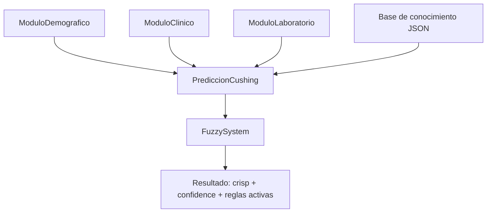

# Motor4 — Sistema difuso (fuzzy) para predicción de Cushing canino

Este directorio (`Backend/motor4/`) contiene **un motor de inferencia difusa completo** + una **instanciación concreta** para estimar el **riesgo/sospecha** de Síndrome de Cushing en perros.

La implementación se apoya en:

- Un **framework fuzzy propio** (paquete `logicaDifusa/`) construido sobre `scikit-fuzzy`.
- Una **base de conocimiento modular en JSON** (`conocimiento/cushing/`) con:
  - definiciones de variables lingüísticas y funciones de pertenencia,
  - reglas difusas (con pesos y conectivas AND/OR),
  - metadatos.
- Un **predictor fachada** (`sistema/PrediccionCushing`) que:
  - carga automáticamente la base JSON,
  - construye variables y reglas,
  - ejecuta inferencia Mamdani,
  - devuelve salida crisp y trazabilidad (reglas activas).

> Nota de alcance: este motor **no diagnostica**; produce una **estimación de riesgo** (0–1) basada en reglas y funciones de pertenencia definidas en la base de conocimiento.

---

## 1) Vista rápida

### Ejecución del ejemplo incluido

El ejemplo completo está en `main.py` y construye:

- módulo demográfico (`ModuloDemografico`),
- módulo clínico (`ModuloClinico`),
- módulo de laboratorio (`ModuloLaboratorio`),
- predictor fuzzy (`PrediccionCushing`).

Ejecuta:

```bash
python Backend/motor4/main.py
```

Salida esperada (resumen):

- `Riesgo estimado` (valor crisp en [0, 1])
- `Confianza fuzzy` (máxima activación de las reglas activas)
- listado de reglas activadas + pesos
- informe de explicabilidad

### Dependencias

Las dependencias están en `Backend/requirements.txt` (incluye `numpy`, `scipy`, `matplotlib`, `scikit-fuzzy`, etc.).

Instalación típica:

```bash
python -m venv .venv
# Windows:
.venv\\Scripts\\pip install -r Backend/requirements.txt
# Linux/WSL:
.venv/bin/pip install -r Backend/requirements.txt
```

---

## 2) Estructura del directorio

```
Backend/motor4/
  main.py                      # Ejemplo de uso end-to-end

  modulos/                     # Entrada estructurada por dominios
    moduloDemografico.py
    moduloClinico.py
    moduloLaboratorio.py

  sistema/                     # Fachada/predictor (carga base, crea variables y reglas, ejecuta inferencia)
    prediccion.py              # Clase abstracta
    prediccionCushing.py       # Implementación concreta para Cushing

  logicaDifusa/                # Framework fuzzy (variables, reglas, sistema, defuzz)
    variables.py               # FuzzyVariable
    funcionesPertenencia.py    # MFs paramétricas (trimf, zmf, smf, ...)
    reglas.py                  # Rule + operadores AND/OR + peso
    sistema.py                 # FuzzySystem (Mamdani + centroid)
    defuzzification.py         # Estrategias de defuzzificación

  conocimiento/                # Base de conocimiento (JSON)
    cushing/
      metadata.json
      variables/
        demograficas.json
        clinicas.json
        laboratorio.json
        consecuente.json
      reglas/
        riesgo_muy_bajo.json
        riesgo_bajo.json
        riesgo_medio.json
        riesgo_alto.json
        riesgo_muy_alto.json
```

---

## 3) Arquitectura (componentes y responsabilidades)



### Capas principales

1. **Entrada (módulos)**
   - Encapsulan datos de paciente por dominios.
   - Son clases simples con getters/setters.

2. **Fachada de predicción (`PrediccionCushing`)**
   - Carga la base JSON.
   - Construye variables fuzzy (antecedentes y consecuentes).
   - Construye reglas fuzzy (antecedentes → consecuente).
   - Mapea módulos → diccionario `inputs` para el motor.
   - Lanza inferencia y devuelve resultados.

3. **Motor difuso (`logicaDifusa/FuzzySystem`)**
   - Evalúa reglas (activación + peso).
   - Agrega salidas (Mamdani: MIN implicación, MAX agregación).
   - Defuzzifica (centroide) y calcula una “confianza”.

4. **Base de conocimiento JSON**
   - Define variables, universos, términos (etiquetas lingüísticas) y reglas.
   - Permite mantener la lógica clínica “fuera del código”.

---

## 4) Contratos de entrada (inputs)

El predictor construye un diccionario `inputs` con **nombres de variables exactamente iguales** a los declarados en `conocimiento/cushing/variables/*.json`.

### 4.1 Módulo demográfico — `modulos/moduloDemografico.py`

Campos:

- `edad` (años, numérica)
- `peso_rel` (porcentaje respecto a la media raza-sexo, numérica)
- `raza` (categórica, *string*)

En `PrediccionCushing.predecir()` se transforman a:

- `edad` → número
- `peso_relativo` → número (nota: el atributo en el módulo se llama `peso_rel`)
- `raza` → string (normalizada internamente por la MF categórica)

### 4.2 Módulo clínico — `modulos/moduloClinico.py`

Campos (booleanos):

- `polidipsia`, `poliuria`, `polifagia`
- `abdomen_inflamado` (mapeado a variable fuzzy `abdomen`)
- `alopecia`
- `debilidad_muscular`
- `piel_fina`
- `jadeo`

Transformación a fuzzy:

- `True` → `1.0`
- `False` (o `None`) → `0.0`

> Implicación práctica: si dejas un síntoma como `None`, el sistema lo tratará como ausencia del signo (0.0).

### 4.3 Módulo de laboratorio — `modulos/moduloLaboratorio.py`

Campos:

- `alp` (U/L)
- `alt` (U/L)
- `usg` (densidad urinaria)
- `colesterol` (mg/dL)

Se pasan como valores numéricos directamente.

---

## 5) Salida del sistema (outputs)

`PrediccionCushing.predecir()` devuelve el resultado de `FuzzySystem.infer(...)` con esta estructura:

- `crisp` (`float`): valor defuzzificado (centroide) del output `riesgo`.
- `confidence` (`float`): máxima activación (ya ponderada por peso) entre las reglas activas.
- `rules` (`list[RuleResult]`): reglas activas con:
  - `activation`: activación final,
  - `consequent`: tupla `(variable_salida, termino_salida)`;
  - `rule`: referencia a la regla evaluada (incluye `weight`).
- `aggregated` (`np.ndarray`): membership agregada del output (misma longitud que el universo de `riesgo`).

Interpretación recomendada:

- `crisp` aproxima un **grado continuo de sospecha** en [0, 1].
- `confidence` no es una probabilidad clínica; es una **medida interna** de cuán fuerte activó la mejor regla.

---

## 6) Base de conocimiento JSON (formato y convenciones)

La base se carga desde:

- `conocimiento/cushing/metadata.json`
- `conocimiento/cushing/variables/*.json`
- `conocimiento/cushing/reglas/*.json`

### 6.1 Metadata

Archivo: `conocimiento/cushing/metadata.json`

Estructura:

```json
{
  "metadata": {
    "version": "1.0",
    "fecha": "16/05/2026",
    "autor": "...",
    "descripcion": "..."
  }
}
```

### 6.2 Variables

Los JSON de variables se fusionan en dos grupos:

- **Antecedentes**: cualquier archivo en `variables/` cuyo nombre **no** contenga la palabra `consecuente`.
- **Consecuentes**: archivos cuyo nombre **sí** contiene `consecuente`.

Cada variable se define como:

```json
{
  "nombre_variable": {
    "tipo": "numerica|binaria|categorica",
    "universo": [inicio, fin, paso],
    "unidad": "...",
    "fuente": "...",
    "terminos": {
      "etiqueta": {"funcion": "trimf|zmf|smf", "params": [...]}
    }
  }
}
```

Notas importantes del motor (`PrediccionCushing._crear_variable_fuzzy`):

- Si `tipo` **falta**, se asume `numerica`.
- Solo existe tratamiento especial para `tipo == "categorica"`.
  - En categóricas no se usa `universo`; internamente se crea un universo dummy `[0.0, 1.0]`.
  - Cada término se define como lista de strings aceptadas.
- `binaria` se trata como variable numérica con universo `[0,1]` y términos `si/no`.

#### Variables categóricas (detalle)

En Cushing hay una variable categórica: `raza`.

- Cada término (`protectora`, `neutra`, `predispuesta_moderada`, `predispuesta_alta`) contiene una lista de razas aceptadas.
- La pertenencia es “crisp”:
  - si la raza está en la lista → membership = 1.0
  - si no está → membership = 0.0

Normalización aplicada por el motor antes de comparar:

- `strip()`
- `lower()`
- espacios y guiones → `_`

Ejemplos:

- `"Bichon Frise"` → `"bichon_frise"`
- `"miniature-schnauzer"` → `"miniature_schnauzer"`

### 6.3 Reglas

Cada archivo en `conocimiento/cushing/reglas/*.json` contiene una lista de reglas. Estructura:

```json
[
  {
    "label": "...",
    "antecedentes": [
      {"variable": "edad", "termino": "mayor"},
      {"variable": "alp", "termino": "elevada"}
    ],
    "conectiva": "AND",
    "consecuente": {"variable": "riesgo", "termino": "alto"},
    "peso": 1.0,
    "fuente": "..."
  }
]
```

Compatibilidad:

- El motor usa `conectiva` como operador lógico.
- Si `conectiva` no está, intenta `tipo` (por compatibilidad) y por defecto asume `AND`.

---

## 7) Algoritmo de inferencia (cómo se calcula el riesgo)

### 7.1 Evaluación de reglas

Cada regla tiene:

- antecedentes: lista de pares `(variable, MF_del_termino)`
- operador: `AND` / `OR`
- peso: `weight`

Para cada antecedente $i$ se calcula el grado de pertenencia:

$$\mu_i = MF_i(x_i)$$

Combinación:

- AND → $\min(\mu_1, \mu_2, ..., \mu_n)$
- OR → $\max(\mu_1, \mu_2, ..., \mu_n)$

Activación final (con peso):

$$\alpha = combine(\mu) \cdot weight$$

Una regla se considera **activa** si $\alpha > 0$.

### 7.2 Agregación Mamdani

Para el consecuente (output) se usa:

- implicación: **MIN** (recorte)
- agregación: **MAX** (unión)

Es decir, para cada regla activa:

- se recorta la MF del término de salida con su activación:

$$\mu_{recortada}(u) = \min(\alpha, \mu_{consecuente}(u))$$

- y luego se agrega sobre todas las reglas:

$$\mu_{agg}(u) = \max_{reglas}(\mu_{recortada}(u))$$

### 7.3 Defuzzificación

El motor usa **centroide** (`CentroidDefuzzifier`):

$$crisp = \frac{\int u\,\mu_{agg}(u)\,du}{\int \mu_{agg}(u)\,du}$$

### 7.4 Confianza

La “confianza fuzzy” se define como:

$$confidence = \max(\alpha_{reglas\ activas})$$

Es un indicador interno de “regla más fuerte”, útil para explicabilidad.

---

## 8) Variables definidas para Cushing (detalle completo)

La configuración actual está en `conocimiento/cushing/variables/`.

### 8.1 Demográficas (`demograficas.json`)

- `edad` (0–20 años, paso 0.1)
  - `joven`: `zmf(0, 4)`
  - `adulto`: `trimf(3, 6.5, 10)`
  - `mayor`: `smf(8, 12)`

- `peso_relativo` (50–150 %, paso 1)
  - `bajo`: `zmf(50, 85)`
  - `normal`: `trimf(80, 100, 120)`
  - `alto`: `smf(115, 140)`

- `raza` (categórica)
  - `protectora`: `golden_retriever`, `labrador_retriever`, `border_collie`, `cocker_spaniel`
  - `neutra`: `mestizo`, `beagle`, `rottweiler`, `boxer`, `west_highland_white_terrier`, `cavalier_king_charles_spaniel`, `cockapoo`, `shih_tzu`, `pomeranian`, `english_springer_spaniel`, `pug`, `chihuahua`, `german_shepherd_dog`, `other_purebred`
  - `predispuesta_moderada`: `staffordshire_bull_terrier`, `jack_russell_terrier`, `lhasa_apso`, `yorkshire_terrier`, `poodle`, `dachshund`
  - `predispuesta_alta`: `bichon_frise`, `border_terrier`, `miniature_schnauzer`

> En el JSON existe `pesos_numericos` para estos términos, pero **el motor actual no lo usa** (la raza se evalúa de forma crisp por pertenencia a la lista).

### 8.2 Clínicas (`clinicas.json`)

Todas las clínicas comparten:

- universo: 0–1 (paso 0.01)
- términos:
  - `no`: `trimf(0, 0, 0.4)`
  - `si`: `trimf(0.6, 1, 1)`

Variables:

- `polidipsia`
- `poliuria`
- `abdomen`
- `alopecia`
- `debilidad_muscular`
- `piel_fina`
- `polifagia`
- `jadeo`

### 8.3 Laboratorio (`laboratorio.json`)

- `alp` (0–3000 U/L, paso 10)
  - `normal`: `zmf(0, 150)`
  - `elevada`: `trimf(100, 400, 800)`
  - `muy_elevada`: `smf(700, 1500)`

- `usg` (1.000–1.060, paso 0.001)
  - `diluida`: `zmf(1.000, 1.015)`
  - `intermedia`: `trimf(1.010, 1.020, 1.030)`
  - `concentrada`: `smf(1.025, 1.045)`

- `alt` (0–1500 U/L, paso 5)
  - `normal`: `zmf(0, 80)`
  - `elevada`: `trimf(60, 150, 350)`
  - `muy_elevada`: `smf(300, 700)`

- `colesterol` (50–600 mg/dL, paso 5)
  - `normal`: `zmf(50, 220)`
  - `elevado`: `trimf(180, 300, 450)`
  - `muy_elevado`: `smf(400, 550)`

### 8.4 Variable de salida (`consecuente.json`)

- `riesgo` (0–1, paso 0.01)
  - `muy_bajo`: `zmf(0, 0.06)`
  - `bajo`: `trimf(0.02, 0.12, 0.24)`
  - `medio`: `trimf(0.28, 0.50, 0.72)`
  - `alto`: `trimf(0.76, 0.87, 0.94)`
  - `muy_alto`: `smf(0.96, 1.0)`

---

## 9) Reglas de Cushing (qué hay implementado)

Las reglas están separadas por nivel de riesgo:

- `riesgo_muy_bajo.json` (3 reglas)
- `riesgo_bajo.json` (4 reglas)
- `riesgo_medio.json` (6 reglas)
- `riesgo_alto.json` (10 reglas)
- `riesgo_muy_alto.json` (4 reglas)

Total: **27 reglas**.

Cada regla incluye:

- `label`: descripción breve
- `antecedentes`: lista de (variable, término)
- `conectiva`: `AND` / `OR`
- `consecuente`: `(riesgo, <nivel>)`
- `peso`: ponderación (1.0 típico; 2.0 en reglas muy fuertes)
- `fuente`: trazabilidad bibliográfica/justificación

---

## 10) Explicabilidad

Hay dos niveles de explicabilidad:

1. **Retorno estructurado** (`results["rules"]`)
   - Lista de `RuleResult` con activación, consecuente y peso.

2. **Informe por consola** (`PrediccionCushing.explicar_decision()`)
   - Imprime las reglas activadas con su activación y peso.

Esto permite justificar *por qué* se obtuvo un riesgo alto/bajo.

---

## 11) Cómo extender o adaptar el motor

### 11.1 Añadir una nueva variable fuzzy

1. Declara la variable en un JSON dentro de `conocimiento/cushing/variables/`.
2. Asegúrate de que el nombre coincide con la clave que usarán las reglas.
3. **Actualiza `PrediccionCushing.predecir()`** para incluir el valor en `inputs`.

Si una regla usa una variable que no está en `inputs`, la evaluación fallará con:

- `ValueError: Falta input para 'variable'`

### 11.2 Añadir reglas

1. Crea o edita un JSON en `conocimiento/cushing/reglas/`.
2. Usa términos que existan en la variable.
3. Ajusta `peso` si quieres priorizar o despriorizar esa regla.

### 11.3 Crear un predictor para otra patología

Patrón recomendado:

- Crear `conocimiento/<patologia>/` con `metadata.json`, `variables/`, `reglas/`.
- Crear `sistema/prediccion<Patologia>.py` copiando la estructura de `PrediccionCushing`.
- Implementar el mapeo de entradas (`inputs`) desde módulos o desde un DTO.

---

## 12) Notas operativas (errores comunes)

- Si `raza` no coincide con las cadenas esperadas (normalizadas), su pertenencia será 0.0 y las reglas que dependan de raza pueden no activarse.
- Si **ninguna regla activa**, `FuzzySystem.infer()` lanza `ValueError("No hay reglas activas")`.
  - Solución típica: revisar cobertura de reglas o entradas fuera de universo/etiquetas.

---

## 13) Referencias internas (código clave)

- `sistema/prediccionCushing.py`
  - carga y fusión de base JSON
  - creación de variables fuzzy (incluye categóricas)
  - construcción de reglas
  - ejecución de inferencia + explicabilidad

- `logicaDifusa/sistema.py`
  - Mamdani + defuzzificación centroide
  - definición de `confidence` como max activación

- `logicaDifusa/reglas.py`
  - evaluación de reglas (AND/OR, peso)

- `conocimiento/cushing/*`
  - “verdad” del modelo (variables + reglas)
